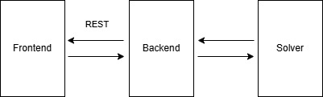

# Biofabric Graph Workspace

Software for visualising clique and community motifs modelled using integer linear programming (ILP) in BioFabric visualization.

  
## Features

- Graph visualization using BioFabric and Node-Link layouts.
- ILP model formulation for optimal ordering of nodes in clique and community motifs.
- Generation of graphs and sets of graphs with varying sizes and densities for testing and analysis.
- Analysis of sets of graphs using differente metrics and parameters.
- Interactive user interface for exploring and comparing results.

## Usage
Workspace has the following views:
- **Graph**: Visualize graphs using Node-Link layouts, allowing users to explore the structure and relationships within the graph.
- **Pipeline**: Create pipelines to generate ILP problems and run Gurobi on loaded graphs.
- **Dataset**: Generate and manage datasets of graphs with varying sizes and densities for testing and analysis.
- **Generator**: Create and customize graph generators to produce specific types of graphs.
- **Scheduler**: Schedule and manage the execution of ILP solving tasks and monitor progress.
- ***Analysis**: Analyze sets of graphs using different metrics and parameters to gain insights into their properties and characteristics.
- **Results**: View and compare the BioFabric visualizations from ILP solving and Node-Link layout, allowing users to apply motif simplification.

## Main Workflow
1. Load or generate a graph in the Graph view.
2. Create a pipeline in the Pipeline view to formulate the ILP model and run Gurobi on the loaded graph.
3. Analyze the results in the Results view, comparing the BioFabric visualization from ILP solving with the Node-Link layout, and apply motif simplification if desired.


## Experimental Workflow
The software also supports an experimental workflow for generating and analyzing sets of graphs:
1. Generate a dataset of graphs with varying sizes and densities in the Dataset view.
2. Launch ILP solving tasks for the generated graphs using the Scheduler view.
3. Analyze the results in the Analysis view, comparing the properties and characteristics of the graphs based on different metrics and parameters.

## Tecnological Stack

- **Frontend**: Html, CSS, JavaScript
- **Backend**: Node.js, Express
- **Solver**: Gurobi (for ILP solving)

  

## System Architecture

The system is structured in a client-server architecture. The backend server handles ILP model formulation, graph generation, and analysis, while the frontend provides an interactive interface for users to visualize and explore the results. The server exposes RESTful APIs for communication between the frontend and backend, allowing for efficient data exchange and seamless user experience. The ILP models are solved using Gurobi.



  

## Requirements

- Node.js
- npm
- Gurobi Optimizer 

  

## Quick Start

```bash
npm install
npm start
```

Open the browser and navigate to http://localhost:3000 to access the application.
The port can be configured in the server.js file if needed.